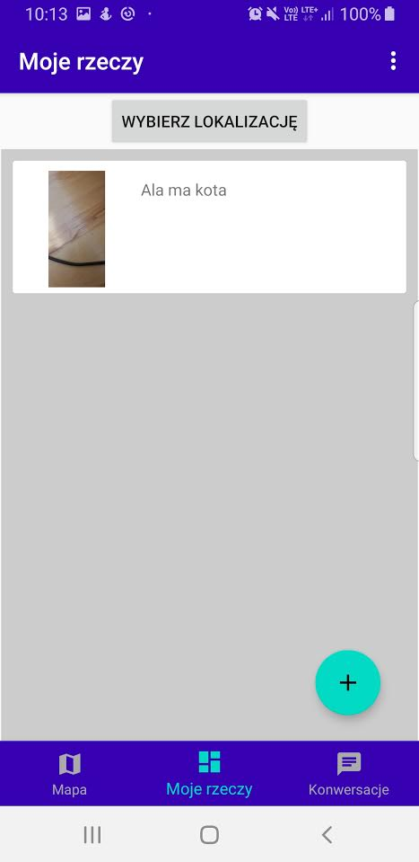

# Andorid Barter App - Sample Project

## Prerequesites:
 - Java 11
 - Android Studio 
 - google-services.json in app-level folder (Get it by creating account at firebase)
 - Populate Google Maps API key in `res/values/google_maps_api.xml`
 
## Features
 - Google authentitcation
 - User can add photos of items to users inventory with location
 - User can browse other users' inventories which are marked on map
 - User can start a conversation with any user found on map.

## Extenal APIs:
 - Firebase Storage (Storing photos)
 - Firebase Realtime Database (Messaging & Users data)
 - Google Maps API (Presenting data on map)
 
## Libraries 
 - Google Play services 
 - Firebase libraires to use firebase API
 - Glide to upload & download photos from firestore with automatic caching (see https://github.com/bumptech/glide)
 - CircleImageView to show avatars (see https://github.com/hdodenhof/CircleImageView)
 - PingPlacePicker to create a place picker (see https://github.com/rtchagas/pingplacepicker)

## Build & Run 
 1. Clone a project from github 
 2. Create android emulator or use  real device
 3. Populate Google Maps API key in `res/values/google_maps_api.xml`
 4. Add google-services.json in app-level folder
 5. Run application (At this point you are ready to build and run the application on your real device or emulator (with google services).)

## Example photos
  
  
  
  
